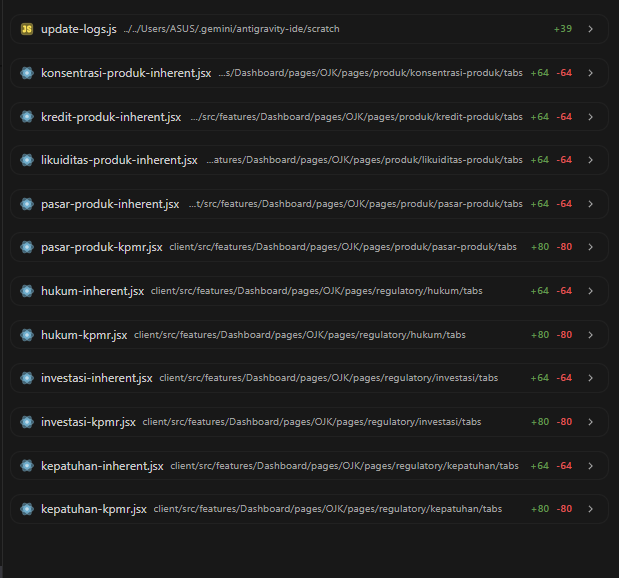

sebelumnya ada masalah infinite loop bersumber di operasionalkpmr file yg diganti kpmr operasional ojk entity, operasional kpmr service dan juga operasional-kpmr hook, tujuan memperbaiki module2 lainnya

untuk melengkapi update fungsi dan struktur backend ojk entity nilai dan parameter serta servicenya

operasional-produk-nilai.entity
operasional-produk-parameter.entity
operasional-produk.service.ts
operasional-produk.controller.ts
operasional-kpmr-ojk.entity

operasional-produk-kpmr.jsx
operasional.jsx
operasional-kpmr.hook.ts
operasional-kpmr.service.ts

hukum, kepatuhan, rentabilitas, tata kelola, investasi, reputasi, strategis, permodalan, operasional

update terakhir, 
-cek untuk backend kredit produk ojk (bukan kpmr kredit)
-cek entity nilai, parameter, dto, service
-

update terakhir 
- berikan prompt setiap module ojk tampilkan entitynya ke deepseek dan buatkan view untuk risk profile repository ojk

propmt 

Saya ingin membuat view `risk_profile_repository_ojk_view` 
yang menggabungkan data dari 12 modul OJK.

Untuk modul PASAR, struktur tabelnya adalah:
- pasar_produk_ojk (header)
- pasar_produk_parameters_ojk (parameter)
- pasar_produk_nilai_ojk (nilai)

Mohon cek struktur DESCRIBE untuk tabel-tabel ini:
1. DESCRIBE pasar_produk_parameters_ojk;
2. DESCRIBE hukum_nilai_ojk;
3. DESCRIBE kredit_parameters_ojk;

Saya perlu tahu nama FK column yang menghubungkan 
parameter ke header untuk SETIAP modul.

Atau Berikan Informasi Ini Sekarang
Jalankan query ini di DBeaver dan berikan hasilnya ke saya:

sql
-- Cek struktur parameter table untuk 4 modul berbeda
DESCRIBE pasar_produk_parameters_ojk;
DESCRIBE hukum_parameters_ojk;
DESCRIBE kredit_parameters_ojk;
DESCRIBE konsentrasi_parameters_ojk;

<!-- ==== -->

TOLONG SESUAIKAN SEMUA PEMANGGILAN AUDIT LOG DI FRONTEND DENGAN ATURAN BERIKUT:

1. GUNAKAN FORMAT POSITIONAL (BUKAN OBJECT):
   logCreate(module, description, additionalData)
   logUpdate(module, description, additionalData)
   logDelete(module, description, additionalData)
   logExport(module, description, additionalData)

2. MODULE YANG VALID (24 module - tidak boleh pakai string bebas):
   HOLDING (11): INVESTASI, PASAR, LIKUIDITAS, OPERASIONAL, HUKUM, STRATEJIK, KEPATUHAN, REPUTASI, USER_MANAGEMENT, SYSTEM, RAS
   OJK (13): HUKUM_OJK, INVESTASI_OJK, KEPATUHAN_OJK, KONSENTRASI_OJK, KREDIT_OJK, LIKUIDITAS_OJK, OPERASIONAL_OJK, PASAR_OJK, PERMODALAN_OJK, RENTABILITAS_OJK, REPUTASI_OJK, STRATEGIS_OJK, TATAKELOLA_OJK

3. INHERENT VS KPMR DIBEDAKAN VIA metadata.type:
   HOLDING: metadata.type = 'inherent' atau 'kpmr'
   OJK: metadata.type = 'inherent' atau 'kpmr'

4. FORMAT PEMANGGILAN YANG BENAR:
   await logCreate('MODULE_NAME', 'Deskripsi aktivitas', {
     userId: currentUser.id,       // number | null
     isSuccess: true,              // boolean
     metadata: {
       type: 'inherent',           // 'inherent' | 'kpmr'
       ...dataTambahan
     }
   });

5. HAPUS field-field berikut karena TIDAK VALID:
   - module (string bebas) → ganti dengan module name dari daftar
   - action → sudah otomatis (CREATE/UPDATE/DELETE/EXPORT)
   - userName → tidak ada di DTO backend
   - userRole → tidak ada di DTO backend

6. CONTOH KONVERSI:
   ❌ SEBELUM:
   await logCreate({
     module: 'KPMR Likuiditas',
     action: 'CREATE',
     description: 'Menambah data...',
     userId: user.userId,
     userName: user.userName,
     userRole: user.userRole,
     metadata: { aspekNo: '1', year: 2025 }
   });

   ✅ SESUDAH:
   await logCreate('LIKUIDITAS', 'Menambah data KPMR Likuiditas - Aspek: 1', {
     userId: currentUser.id,
     isSuccess: true,
     metadata: { type: 'kpmr', aspekNo: '1', year: 2025 }
   });

7. DAFTAR MODULE PER HALAMAN:
   - Likuiditas Inherent → 'LIKUIDITAS', type: 'inherent'
   - Likuiditas KPMR → 'LIKUIDITAS', type: 'kpmr'
   - Pasar Inherent → 'PASAR', type: 'inherent'
   - Pasar KPMR → 'PASAR', type: 'kpmr'
   - Operasional Inherent → 'OPERASIONAL', type: 'inherent'
   - Operasional KPMR → 'OPERASIONAL', type: 'kpmr'
   - Hukum Inherent → 'HUKUM', type: 'inherent'
   - Hukum KPMR → 'HUKUM', type: 'kpmr'
   - Strategik Inherent → 'STRATEJIK', type: 'inherent'
   - Strategik KPMR → 'STRATEJIK', type: 'kpmr'
   - Kepatuhan Inherent → 'KEPATUHAN', type: 'inherent'
   - Kepatuhan KPMR → 'KEPATUHAN', type: 'kpmr'
   - Reputasi Inherent → 'REPUTASI', type: 'inherent'
   - Reputasi KPMR → 'REPUTASI', type: 'kpmr'
   - Investasi Inherent → 'INVESTASI', type: 'inherent'
   - Investasi KPMR → 'INVESTASI', type: 'kpmr'
   - RAS → 'RAS', tanpa type
   - User Management → 'USER_MANAGEMENT', tanpa type
   - System → 'SYSTEM', tanpa type
   - OJK Konsentrasi Inherent → 'KONSENTRASI_OJK', type: 'inherent'
   - OJK Konsentrasi KPMR → 'KONSENTRASI_OJK', type: 'kpmr'
   - OJK Kredit Inherent → 'KREDIT_OJK', type: 'inherent'
   - OJK Kredit KPMR → 'KREDIT_OJK', type: 'kpmr'
   - OJK Likuiditas Inherent → 'LIKUIDITAS_OJK', type: 'inherent'
   - OJK Likuiditas KPMR → 'LIKUIDITAS_OJK', type: 'kpmr'
   - OJK Pasar Inherent → 'PASAR_OJK', type: 'inherent'
   - OJK Pasar KPMR → 'PASAR_OJK', type: 'kpmr'
   - OJK Operasional Inherent → 'OPERASIONAL_OJK', type: 'inherent'
   - OJK Operasional KPMR → 'OPERASIONAL_OJK', type: 'kpmr'
   - OJK Hukum Inherent → 'HUKUM_OJK', type: 'inherent'
   - OJK Hukum KPMR → 'HUKUM_OJK', type: 'kpmr'
   - OJK Strategis Inherent → 'STRATEGIS_OJK', type: 'inherent'
   - OJK Strategis KPMR → 'STRATEGIS_OJK', type: 'kpmr'
   - OJK Kepatuhan Inherent → 'KEPATUHAN_OJK', type: 'inherent'
   - OJK Kepatuhan KPMR → 'KEPATUHAN_OJK', type: 'kpmr'
   - OJK Reputasi Inherent → 'REPUTASI_OJK', type: 'inherent'
   - OJK Reputasi KPMR → 'REPUTASI_OJK', type: 'kpmr'
   - OJK Permodalan Inherent → 'PERMODALAN_OJK', type: 'inherent'
   - OJK Permodalan KPMR → 'PERMODALAN_OJK', type: 'kpmr'
   - OJK Rentabilitas Inherent → 'RENTABILITAS_OJK', type: 'inherent'
   - OJK Rentabilitas KPMR → 'RENTABILITAS_OJK', type: 'kpmr'
   - OJK Investasi Inherent → 'INVESTASI_OJK', type: 'inherent'
   - OJK Investasi KPMR → 'INVESTASI_OJK', type: 'kpmr'
   - OJK Tatakelola Inherent → 'TATAKELOLA_OJK', type: 'inherent'
   - OJK Tatakelola KPMR → 'TATAKELOLA_OJK', type: 'kpmr'

TERAPKAN PERUBAHAN INI KE SEMUA FILE JSX YANG MEMANGGIL logCreate, logUpdate, logDelete, logExport.

